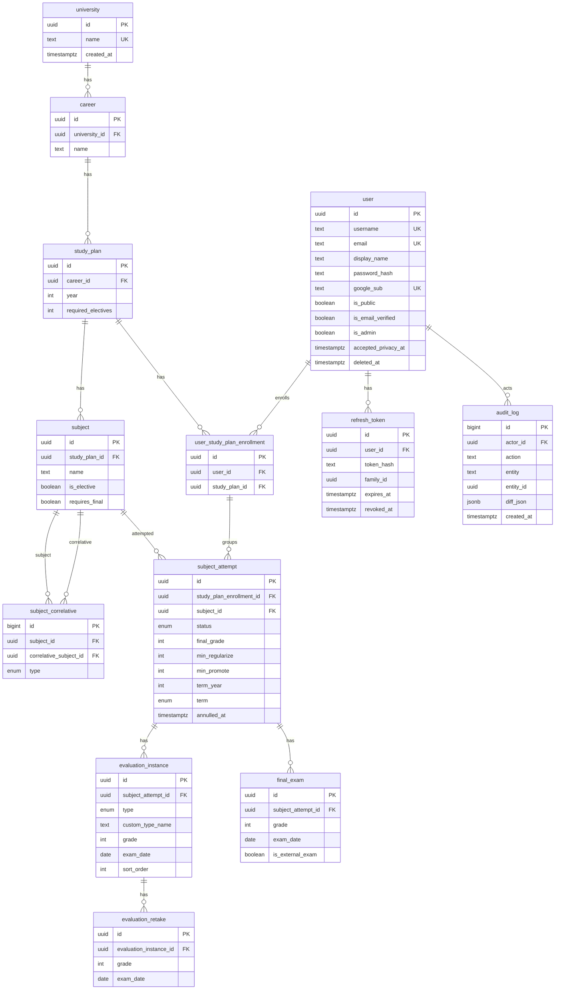

# Base de datos

> Esquema en `snake_case`. Código en `camelCase`. Constantes `SCREAMING_SNAKE`. IDs publicas `UUIDv7` en URLs; internas `BIGINT`. Nombres de tablas y clases en singular.

## Convenciones

- Prisma schema en ingles, tablas `snake_case` y en singular.
- `created_by/at`, `updated_by/at` en todas las tablas de dominio.
- PKs publicas: `UUIDv7` (`uuid` nativo PG). Tablas solo relación internas (`subject_correlative`) pueden ser `BIGINT GENERATED ALWAYS AS IDENTITY`.
- FKs explicitas en DB; en código solo IDs (desacople). Cross module via read models, no JOIN Prisma.
- búsqueda: `ILIKE 'nombre%'` (prefix) con `B-Tree` en `name`. Se evita `%nombre%` para no forzar seq scan. `pg_trgm` solo si se necesita luego.

## ERD

## Restricciones

| Entidad | Restricción |
|---------|-------------|
| `university` | `name` es unico |
| `career` | `(university_id, name)` es unico |
| `study_plan` | `(career_id, year)` es unico |
| `subject` | `(study_plan_id, name)` es unico |
| `subject_correlative` | `(subject_id, correlative_subject_id)` es unico; `subject_id != correlative_subject_id`; ambas subjects del mismo `study_plan` (validado en app; sin ciclos, validado en app con BFS) |
| `user` | `username` es unico |
| `user` | `email` es unico |
| `user` | `google_sub` es unico cuando no es `NULL` |
| `user_study_plan_enrollment` | `(user_id, study_plan_id)` es unico |

### Campos nullable

* `user.password_hash`
* `user.google_sub`
* `user.accepted_privacy_at`
* `user.deleted_at`
* `subject_attempt.final_grade`
* `subject_attempt.term_year`
* `subject_attempt.term`
* `subject_attempt.annulled_at`
* `evaluation_instance.custom_type_name`
* `evaluation_instance.grade`
* `evaluation_instance.exam_date`
* `evaluation_retake.exam_date`
* `final_exam.grade`
* `final_exam.exam_date`
* `refresh_token.revoked_at`

`subject_attempt.study_plan_enrollment_id` es NOT NULL. No existe cursada sin enrollment. El `user_id` se deriva via `user_study_plan_enrollment.user_id` en read models.

## Detalle por tabla

### `user`
`id UUIDv7 PK`, `username UQ`, `email UQ`, `display_name`, `password_hash nullable` (nullable por OAuth), `google_sub UQ nullable`, `is_public bool default false`, `is_email_verified bool default false`, `is_admin bool default false`, `accepted_privacy_at nullable` (consentimiento Ley 25.326), `deleted_at nullable` (soft delete; `NULL` = activa), `created_by/at`, `updated_by/at`. Índice `B-Tree(deleted_at)` para el job de purga.

### `university`
`id UUIDv7 PK`, `name UQ`.

### `career`
`id UUIDv7 PK`, `university_id FK`, `name`, `UQ(university_id, name)`.

### `study_plan`
`id UUIDv7 PK`, `career_id FK`, `year int`, `required_electives int default 0`, `UQ(career_id, year)`. Indice `B-Tree(year)`.

### `subject`
`id UUIDv7 PK`, `study_plan_id FK`, `name`, `is_elective bool default false`, `requires_final bool default true`, `UQ(study_plan_id, name)`, `B-Tree(name)` para `ILIKE nombre%`.

### `subject_correlative`
`id BIGINT PK`, `subject_id FK` hacia `subject`, `correlative_subject_id FK` hacia `subject`, `type ENUM('PREVIOUS','CONCURRENT')`, `UQ(subject_id, correlative_subject_id)`. Solo `AND` (ver [specification.md](./specification.md) sección 5.2).

### `user_study_plan_enrollment`
`id UUIDv7 PK`, `user_id FK`, `study_plan_id FK`, `UQ(user_id, study_plan_id)`. Es la raíz de lock: toda mutación de cursada hace `SELECT FOR UPDATE` sobre esta fila.

### `subject_attempt`
Histórico N intentos por enrollment y subject. `id UUIDv7 PK`, `study_plan_enrollment_id FK NOT NULL`, `subject_id FK`, `status ENUM('IN_PROGRESS','PENDING_FINAL','PASSED','FAILED')` (`FAILED` = desaprobado cerrado, solo vía cierre explícito; `AVAILABLE` y `NOT_AVAILABLE` son vista computada, ver [specification.md](./specification.md) sección 5.1), `final_grade 1-10 nullable`, `min_regularize default 4`, `min_promote default 7` (umbrales del attempt, editables solo en `IN_PROGRESS`), `term_year nullable`, `term ENUM('FIRST','SECOND') nullable`, `annulled_at nullable` (intento anulado por promoción posterior; se ignora en agregado y promedios), `created_by/at`, `updated_by/at`. Indices `B-Tree(study_plan_enrollment_id, subject_id)`, `B-Tree(status)`, `B-Tree(annulled_at)`. El `user_id` se obtiene via JOIN a `user_study_plan_enrollment` en read models. Regla de unicidad parcial en app (no constraint DB): un solo attempt no anulado en `IN_PROGRESS` o `PENDING_FINAL` por `(study_plan_enrollment_id, subject_id)`; la creación valida el estado visible y devuelve `409` si no es `AVAILABLE` o `PENDING_FINAL`.

### `evaluation_instance`
`id UUIDv7 PK`, `subject_attempt_id FK`, `type ENUM('PARTIAL','PRACTICAL_WORK','DELIVERABLE','OTHER')`, `custom_type_name nullable` (obligatorio si `OTHER`), `grade 1-10 nullable`, `exam_date nullable`, `sort_order`.

### `evaluation_retake`
`id UUIDv7 PK`, `evaluation_instance_id FK`, `grade 1-10`, `exam_date nullable`, `created_at`. La nota efectiva de la instancia es `MAX(instance.grade, retakes.grade)`.

### `final_exam`
`id UUIDv7 PK`, `subject_attempt_id FK`, `grade nullable`, `exam_date nullable`, `is_external_exam bool default false` (rendir libre; habilita `AVAILABLE -> PASSED`). Regla en app: bloqueado (`409`) si existe sibling `IN_PROGRESS` no anulado para el mismo `(enrollment, subject)`.

### `refresh_token` (ver [auth.md](./auth.md))
`id UUIDv7 PK`, `user_id FK`, `token_hash` (nunca el token en claro), `family_id UUID` (familia de rotación para reuse-detection), `expires_at`, `revoked_at nullable`.

### `audit_log`
`id BIGINT PK`, `actor_id FK -> user`, `action` (`CREATE|UPDATE|DELETE`), `entity` (`university|career|study_plan|subject|subject_correlative`), `entity_id UUID`, `diff_json JSONB`, `created_at`. Se escribe en la misma transacción que el cambio de catálogo. Índice `B-Tree(entity, entity_id)`.

## Read models

Projections DTO directo desde DB (`select id, name, status` y similares), no entidades completas. Ejemplo: `AvailableSubjectReadModel` cruza `subject` y `subject_correlative` y `subject_attempt` (filtrando `annulled_at IS NULL`) via query nativa o Prisma `findMany select`. Para `subject_attempt` el `user_id` se proyecta con JOIN a `user_study_plan_enrollment`.

## Row Level Security (RLS) — hardening temprano

RLS como defensa en profundidad, no reemplaza filtros en app (ownership `enrollment.user_id = req.user.id` + guard `AdminOnly`).

- Tablas con RLS: `user_study_plan_enrollment`, `subject_attempt`, `evaluation_instance`, `evaluation_retake`, `final_exam`, `refresh_token`. Catálogo (`university`, `career`, `study_plan`, `subject`, `subject_correlative`) es público (RLS no aplica).
- Política: `USING (user_id = current_setting('app.user_id', true)::uuid)` o via `study_plan_enrollment.user_id` con JOIN. `FOR ALL` con `WITH CHECK` igual a `USING`.
- Implementacion con Prisma (single role): middleware Nest por request autenticado ejecuta `SET LOCAL app.user_id = '<uuid>'` antes de cualquier query en la transacción. Requests no autenticados no setean (ven solo catálogo público). `FORCE RLS` en tablas protegidas.
- Migración: `ALTER TABLE ... ENABLE ROW LEVEL SECURITY; CREATE POLICY ...; ALTER TABLE ... FORCE ROW LEVEL SECURITY;`. Tests con 2 usuarios: `SET LOCAL` como A no debe leer rows de B.
- `ponytail: SET LOCAL por request, sin pooling por role. Si aparece PgBouncer transaction pooling con SET LOCAL, mover a RLS por vista o check en app.`

## Migraciones

Prisma Migrate. Un archivo por cambio. Nunca editar migración aplicada. RLS se agrega en migración dedicada post tablas base.
